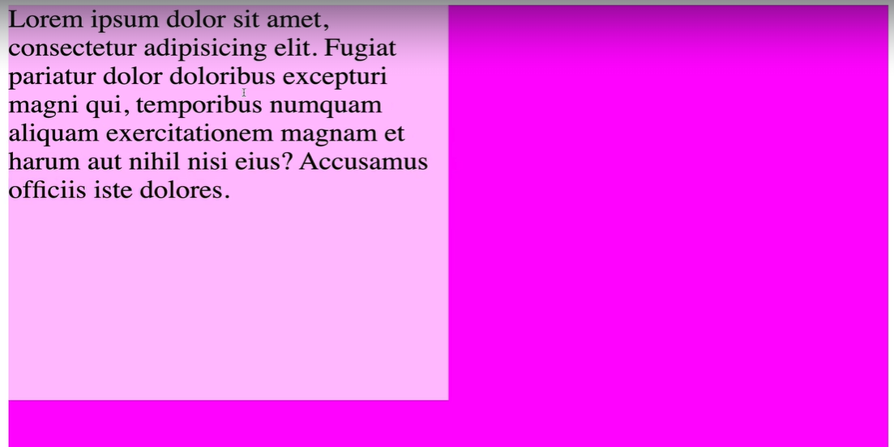
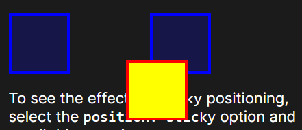
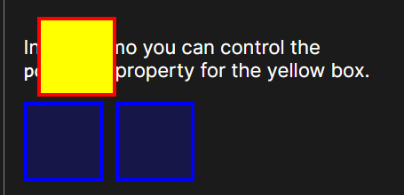
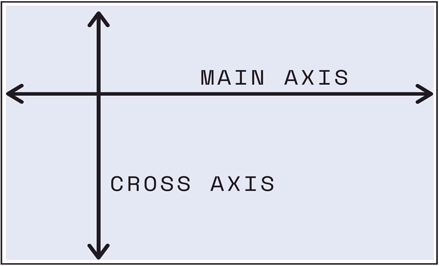
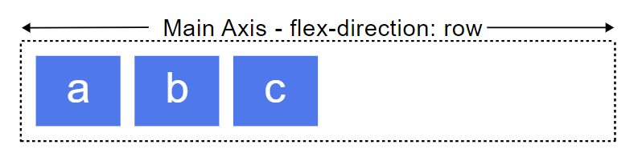
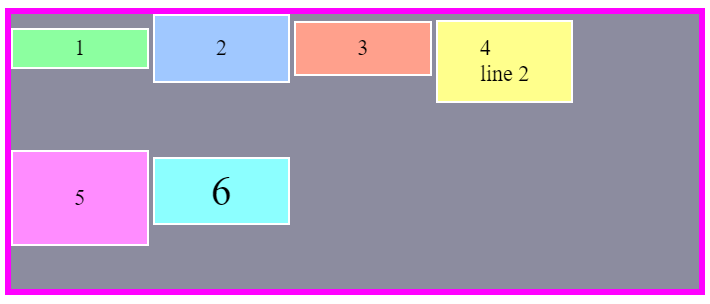
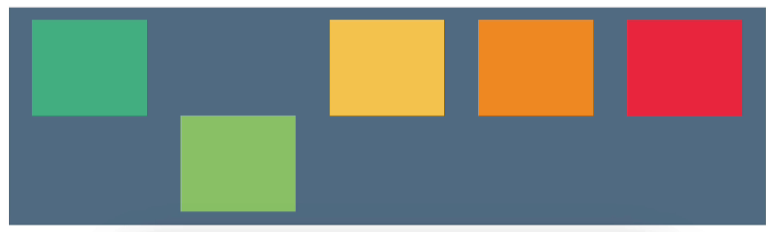
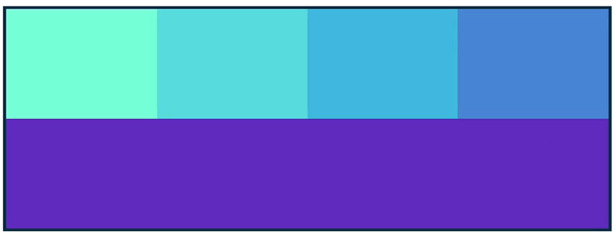

<link rel="stylesheet" href="styles.css">

# CSS Notes

This is a slow accumulation of my CSS concepts compiled from various resources.

Main Resources: 

1. [MDN Web Docs / CSS](https://developer.mozilla.org/en-US/docs/Web/CSS)

2. [W3 Schools CSS References](https://www.w3schools.com/cssref/index.php)

## Display Properties


### Inline
Width & height are ignored. Margin & padding push other elements away horizontally but not vertically.

### Block
Block elements break the flow of a document. Width, Height, Margin & Padding are respected

### Inline-Block
Behaves like an inline element except width. Height, margin & padding are respected.

## Selectors

```css
selector {
    property: value;
}
```
### CSS Cascades
*Order in which styles are declared matters!!*
styles are applied from top to bottom, overwriting any repeated selectors.

### Specifcity
Specificity is how the browser decides which rules to apply when multiple rules could apply to the same element. 

It is a measure of how specific a given selector is. The more specific selector "wins"

A specificity calculator is used.
> Inline Styles > ID > Class, Attribute, & Pseudo-class Selectors > Element, Pseudo Element selectors

e.g. element vs element descendant

### Inheritance

Sometimes there are no declarations defining the value of a property. The CSS cascade module defines how these missing values should be set via inheritance or from the property's initial value.

----------

- `universal selectors (*)`
- `element selector (buttons, h1, h2, p)`
- `id selector (#id)` - can only be applied to one element
- `class selector (.class)` - can be used repeatedly
- `descendant selector*(e.g. li a)` `- selecting descendents
- `*adjacent selector* (e.g. h1 + button)` - selects only the buttons that are immediately after a h1 
- `*direct child selector* (e.g. div > li)` - selects ony the `<li>`s that are direct children of a `<div>` element
- `*attribute selector* (h1[type/class/id="text"])` - selects all h1 elements where the type or class or id attribute is set to "text"
- `child combinator selector (nav > ul)` - placed between two CSS selectors. It matches only those elements matched by the second selector that are the direct children of elements matched by the first.

### Pseudo Classes
keywords added to a selector that specifies a special state of the selected element(S)

#### `:hover`
matches when user hovers with their mouse over an element 

e.g. 
```css
/* When button is hovered over, it's background turns red, text turns white */
.post button:hover {
    background-color: red;
    coloe: white;
    font-weight: 800;
}
```
#### `:active`
matches an element that is activated by the user (usually when clicked)

```css
button:active {
    background-color: red;
    text-decoration: underline;
}
```

#### `:checked`
represents any radio, checkbox, or option element that is checked or toggled to an **on** state

#### `:nth-of-type`
represents elements of a given type, based on their position among a group of siblings

e.g. Website contains a list of posts, you want to use a darker color on every other one

```css
.post: nth-of-type(2n){
    background-color: dark green;
}
```
### Pseudo Elements
Keywords added to a selector that lets you style a particular part of selected element(s)

#### `::first-letter`
applies styles to the first letter of the first line of a block container, but only when not preceded by other content (such as images or inline tables)

```css
p::first-letter {
  font-size: 1.5rem;
  font-weight: bold;
  color: brown;
}

```
#### `::selection`
applies styles to part of a document that has been highlighted/selected by the user

```
p::selection {
  color: red;
  background-color: yellow;
}
```
#### `::before`
 It is often used to add cosmetic content to an element with the content property. It is inline by default.

 ```css
 /* adds a link emoji before an <a> link */
 a::before {
  content: '🔗';
}
 ```
```css
/* Populates question numbers with "Question #" preceding it, e.g. Question #4 */
p::before{
  content: "Question #";
}

```

## Typography

### html selector

### dividers

border-bottom: 2px solid #

### letter-spacing

### rem, em 

### Adding google fonts to your sheet

1. getting the ref link from google fonts
2. linking
3. referencing in selectors

### SVG
- scalable 
- img {
  width: max(250px, 25vw);
}
- if below 1000px, use 250px. if above 100px, 25% of viewport


### Box-sizing

_Defines how the width and height of an element are calculated: should they include padding or borders?_

Border-box vs Content-box


`content-box`(default):

- `width` and `height` assigned to element only applies to the content box, which excludes any `border` or `padding`
- e.g. if element's `width` is set to 300px and hence content box only, a border of 5px, padding of 5px will add 20px total. The total width will be 320px.

`border-box`:

- instructs browser to account for `border` and `padding` values in the `width`
- e.g. if an element's `width` is set to 300px. The 20px total of `border` and `padding` are inclusive. This also means that the content box will shrink to absorb that extra width

> Generally `border-box` is easier to deal with while not dealing with the accuracy of your pixels. But when using `position: relative/absolute`, `content-box` allows the positioning values to be relative to the content, and independent of changes to border and padding sizes which is sometimes desirable

## Accessibility 

### role attribute
used to indicate the purpose behind an element on the page to assistive technologies. The role attribute is a part of the Web Accessibility Initiative (WAI), and accepts preset values.

### aria-labelled by
referenced in id
The aria-labelledby attribute identifies the element (or elements) that labels the element it is applied to.

### Linking each input to corresponding label
It is important to link each input to the corresponding label element. This provides assistive technology users with a visual reference to the input.

```css
        <section role="region" aria-labelledby="student-info">
          <h2 id="student-info">Student Info</h2>
          <div class="info">
          /* label references id of input with a for attribute */
            <label for="student-name">Name</label>
            <input id="student-name"/>
          </div>
          <div class="info">
            <label for="email-add">Email Address</label>
            <input id="email-add"/>
          </div>
          <div class="info">
            <label for="dob">Date of Birth</label>
            <input id="dob"/>
          </div>
        </section>
```

### Screen Readers only
Some text are abbreviated and easily understandable by an average person, but accessibility if considered can hide labels that are meant to be read by screen readers only. 

This pattern is to set the following CSS properties for sr-only class:

```css
.sr-only {
    position: absolute;
    width: 1px;
    height: 1px;
    padding: 0;
    margin: -1px;
    overflow: hidden;
    clip: rect(0, 0, 0, 0);
    white-space: nowrap;
    border: 0;
}
```

// to be added 

## Other CSS Properties
### rgba / alpha channel 

- only affects background color, not text element
- hexadecimal can be used, last two digits, 00 to FF


### opacity
- applies to all elements within div

----------

### position 
- sets how an element is positioned in a document `top`, `bottom`, `left`, `right` properties determine the final location of positioned elements

####1. `: static`

Element is positioned according to the normal flow of the document. The `top`, `bottom`, `left`, `right`, `z-index` properties have no effect. 

#### 2. `:relative`

Element is positioned according to the normal flow of the document and then offset relative to itself based on `top`, `bottom`, `left`, `right`. Other elements are not affected. Space is still given to the element as if it were static. 



`position: relative;
top: 50px; left: 50px;`

#### 3. `:absolute`

The element is removed from the normal document flow, and *no space* is created for the element in the page layout. The element is positioned relative to its **closest positioned ancestor** (if any) or to the initial containing block. 

*what does **closest positioned ancestor** mean?*
- the ancestor that has a position set for example to relative, and it is the least number of nests away 
- the element will start shifting `top`, `bottom`, `left`, `right` from the top left corner of that div container or element with position: relative

final position is determined by `top`, `bottom`, `left`, `right`.



yellow box is positioned relative to the initial containing block

`position: absolute;
top: 1px; left: 1px;`


#### 4. `:fixed`

Element is removed from normal document flow, no space is created for the element in the page layout. The element is positioned to its initial containing block, which is the viewport in the case of visual media. 

final position is determined by `top`, `bottom`, `left`, `right`.

The element stays in the same position throughout every page and scrolling. 

#### 5. `:sticky`

Element is positioned according to the normal flow of the document, and then offset relative to its nearest scrolling ancestor and containing block. final position is determined by `top`, `bottom`, `left`, `right`.

The element goes into its fixed position once containing block is out of scroll.

----------

### CSS Transitions

Transitions enable you to define the transition between two states of an element. Different states may be defined using pseudo-classes like :hover or :active or dynamically set using JavaScript.

>Transition: Property Name | Duration |  Timing Function |Delay

- Property names: background-color, border-radius...
- Timing function: ease-in, linear, [site for timing functions](https://easings.net)

----------

### CSS Transforms

Scales, skews or translates elements. 

https://developer.mozilla.org/en-US/docs/Web/CSS/transform


----------

## Flexbox
One dimensional layout method for laying out items in rows/columns

https://flexboxfroggy.com/

### Flex-direction



**Main Axis** - `row`, `row-reverse`,  `column`, `column-reverse`

reverse: takes the elements and displays the order in reverse




**Cross axis** - perpendicular to the main axis

### Justify-content

Adjusts content according to the MAIN AXIS

`start`/`flex-start`: pack (flex) items at the start 
`end`/`flex-end`: pack (flex) items at the end 
`center`: pack items in the center
`space-between`: Distribute items evenly, first item is flushed to the start and last is flushed to the end 
`space-around`: Distribute items evenly, start and end gaps are half the size of the space between each items
`space-evenly`: Distribute items evenly, start, in-between, and end gaps have equal sizes
`stretch`: Distribute items evenly, stretch 'auto'-sized items to fit the container

### Align-Items

Adjusts content according to the CROSS AXIS

`start`: items are packed towards cross start edge 
`end`: items are packed towards cross end edge 
`center`: itmes are centered within the line on the cross-axis
`baseline`: all flex-items are aligned such that their flex-container baselines align



### flex-wrap

Sets whether flex items are forced onto one line or can wrap onto multiple lines

`nowrap`: flex items are laid out in a single line
`wrap`: flex items break into multiple lines. Cross-start is depending on flex-direction
`wrap-reverse`: behaves same as wrap but cross-start and cross-end are permuted

### Align-content

Distributes space between **multi-lined** flexed-contents in cross-axis. It has no effect for single line flex items.

`start`, `end`, `space-around`, `space-between`, `space-evenly`

### Align-self

Targets one element in spite of other flex alignmen



### Flex sizing

shorthand: /* Three values: flex-grow | flex-shrink | flex-basis */

#### Flex-basis

Defines the initial size of an element before additional space is distributed. Flex basis might alter width or height according to its flex-direction, row or column respectively.

e.g. if flex-basis: 400px, each content will be 400px in height if arranged in a column, and 400px in width if arranged in a row

#### Flex-grow

Controls the amount of available space an element should take up as page size changes. Accepts a unit-less number.

`flex-grow: 1;` takes up all additional space, if more than one element has flex-grow: 1, the space is evenly distributed

However, this is how a spillover would look like:
set a min-width/max-width to prevent this behaviour



`flex-grow: 2;`: when number is not 1, the grow behaviour will adjust relative to the other items, e.g. an item of flex-grow: 2 will take up twice of the extra space compared to an item of flex-grow: 1

#### Flex-shrink

Works the same way as flex-shrink, if items are larger than the container, they shrink according to the flex-shrink.


## Media queries 

https://developer.mozilla.org/en-US/docs/Web/CSS/@media

```css
/* Extra small devices (phones, 600px and down) */
@media only screen and (max-width: 600px) {...}

/* Small devices (portrait tablets and large phones, 600px and up) */
@media only screen and (min-width: 600px) {...}

/* Medium devices (landscape tablets, 768px and up) */
@media only screen and (min-width: 768px) {...}

/* Large devices (laptops/desktops, 992px and up) */
@media only screen and (min-width: 992px) {...}

/* Extra large devices (large laptops and desktops, 1200px and up) */
@media only screen and (min-width: 1200px) {...}
```

note: media queries can be overwritten and hence the order matters, should be written in increasing min-width or decreasing max-width


