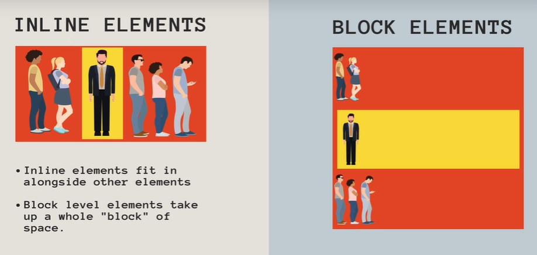

<style>
.o { background-color: rgb(253,111,65) }
.g { background-color: rgb(124,201,71) }
.b { background-color: rgb(70,177,249) }
.c { background-color: rgb(102,217,239) }
.m { background-color: rgb(174,129,255) }
.y { background-color: rgb(247,207,11) }
.bm {background-color: rgb(127,125,248)}
</style>

# CSS Notes{.b}

This is a slow accumulation of my CSS concepts compiled from various resources.

!!! Main useful resources

1. [MDN Web Docs / CSS](https://developer.mozilla.org/en-US/docs/Web/CSS)

2. [W3 Schools CSS References](https://www.w3schools.com/cssref/index.php)

## Display Properties {.o}


### Inline {.g}
Width & height are ignored. Margin & padding push other elements away horizontally but not vertically.

### Block {.g}
Block elements break the flow of a document. Width, Height, Margin & Padding are respected

### Inline-Block
Behaves like an inline element except width. Height, margin & padding are respected.

## Selectors

```css
selector {
    property: value;
}
```
### CSS Cascades
*Order in which styles are declared matters!!*
styles are applied from top to bottom, overwriting any repeated selectors.

### Specifcity
Specificity is how the browser decides which rules to apply when multiple rules could apply to the same element. 

It is a measure of how specific a given selector is. The more specific selector "wins"

A specificity calculator is used.
> Inline Styles > ID > Class, Attribute, & Pseudo-class Selectors > Element, Pseudo Element selectors

e.g. element vs element descendant

### Inheritance

Sometimes there are no declarations defining the value of a property. The CSS cascade module defines how these missing values should be set via inheritance or from the property's initial value.

----------

- `*universal selectors* (*)`
- `*element selector* (buttons, h1, h2, p)`
- `*id selector* (#id)` - can only be applied to one element
- `*class selector* (.class)` - can be used repeatedly
- `*descendant selector* (e.g. li a)` `- selecting descendents
- `*adjacent selector* (e.g. h1 + button)` - selects only the buttons that are immediately after a h1 
- `*direct child selector* (e.g. div > li)` - selects ony the `<li>`s that are direct children of a `<div>` element
- `*attribute selector* (h1[type/class/id="text"])` - selects all h1 elements where the type or class or id attribute is set to "text"
- `child combinator selector (nav > ul)` - placed between two CSS selectors. It matches only those elements matched by the second selector that are the direct children of elements matched by the first.

### Pseudo Classes
keywords added to a selector that specifies a special state of the selected element(S)

#### `:hover`
matches when user hovers with their mouse over an element 

e.g. 
```css
/* When button is hovered over, it's background turns red, text turns white */
.post button:hover {
    background-color: red;
    coloe: white;
    font-weight: 800;
}
```
#### `:active`
matches an element that is activated by the user (usually when clicked)

```css
button:active {
    background-color: red;
    text-decoration: underline;
}
```

#### `:checked`
represents any radio, checkbox, or option element that is checked or toggled to an **on** state

#### `:nth-of-type`
represents elements of a given type, based on their position among a group of siblings

e.g. Website contains a list of posts, you want to use a darker color on every other one

```css
.post: nth-of-type(2n){
    background-color: dark green;
}
```
### Pseudo Elements
Keywords added to a selector that lets you style a particular part of selected element(s)

#### `::first-letter`
applies styles to the first letter of the first line of a block container, but only when not preceded by other content (such as images or inline tables)

```css
p::first-letter {
  font-size: 1.5rem;
  font-weight: bold;
  color: brown;
}

```
#### `::selection`
applies styles to part of a document that has been highlighted/selected by the user

```
p::selection {
  color: red;
  background-color: yellow;
}
```
#### `::before`
 It is often used to add cosmetic content to an element with the content property. It is inline by default.

 ```css
 /* adds a link emoji before an <a> link */
 a::before {
  content: '🔗';
}
 ```
```css
/* Populates question numbers with "Question #" preceding it, e.g. Question #4 */
p::before{
  content: "Question #";
}

```

## Typography

### html selector

### dividers

border-bottom: 2px solid #

### letter-spacing

### rem

### Adding google fonts to your sheet

1. getting the ref link from google fonts
2. linking
3. referencing in selectors

### SVG
- scalable 
- img {
  width: max(250px, 25vw);
}
- if below 1000px, use 250px. if above 100px, 25% of viewport


### Box-sizing

_Defines how the width and height of an element are calculated: should they include padding or borders?_

Border-box vs Content-box


`content-box`(default):

- `width` and `height` assigned to element only applies to the content box, which excludes any `border` or `padding`
- e.g. if element's `width` is set to 300px and hence content box only, a border of 5px, padding of 5px will add 20px total. The total width will be 320px.

`border-box`:

- instructs browser to account for `border` and `padding` values in the `width`
- e.g. if an element's `width` is set to 300px. The 20px total of `border` and `padding` are inclusive. This also means that the content box will shrink to absorb that extra width

> Generally `border-box` is easier to deal with while not dealing with the accuracy of your pixels. But when using `position: relative/absolute`, `content-box` allows the positioning values to be relative to the content, and independent of changes to border and padding sizes which is sometimes desirable

## Accessibility 

### role attribute
used to indicate the purpose behind an element on the page to assistive technologies. The role attribute is a part of the Web Accessibility Initiative (WAI), and accepts preset values.

### aria-labelled by
referenced in id
The aria-labelledby attribute identifies the element (or elements) that labels the element it is applied to.

### Linking each input to corresponding label
It is important to link each input to the corresponding label element. This provides assistive technology users with a visual reference to the input.

```css
        <section role="region" aria-labelledby="student-info">
          <h2 id="student-info">Student Info</h2>
          <div class="info">
          /* label references id of input with a for attribute */
            <label for="student-name">Name</label>
            <input id="student-name"/>
          </div>
          <div class="info">
            <label for="email-add">Email Address</label>
            <input id="email-add"/>
          </div>
          <div class="info">
            <label for="dob">Date of Birth</label>
            <input id="dob"/>
          </div>
        </section>
```

### Screen Readers only
Some text are abbreviated and easily understandable by an average person, but accessibility if considered can hide labels that are meant to be read by screen readers only. 

This pattern is to set the following CSS properties for sr-only class:

```css
.sr-only {
    position: absolute;
    width: 1px;
    height: 1px;
    padding: 0;
    margin: -1px;
    overflow: hidden;
    clip: rect(0, 0, 0, 0);
    white-space: nowrap;
    border: 0;
}
```


